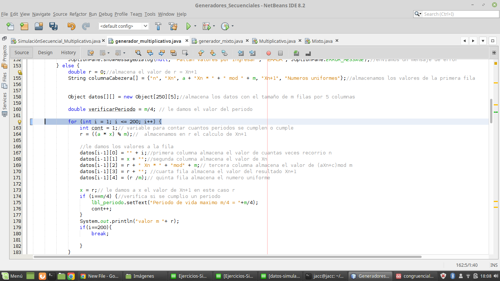

# Tarea generadores secuenciales
# Ejercicio 1:
## a).
### Datos ingresados generador mixto:
* k = 5
* X_0 = 21
* m = 31
* c = 15

## b).
### Datos ingresados generador mixto:
* k = 3
* X_0 = 7
* m = 128
* c = 9

## c).
### Datos ingresados generador multiplicativo:
* k = 4
* X_0 = 23
* m = 31

## d).
### Datos ingresados generador mixto:
* k = 1
* X_0 = 17
* m = 256
* c = 121

## e).
### Datos ingresados generador mixto:
* k = 5
* X_0 = 21
* m = 31
* c = 15

# Ejercicio 2:
## a).
### Datos ingresados generador mixto:
* k = 34
* X_0 = 5
* m = 17
* c = 47

## b).
### Datos ingresados generador mixto:
* k = 47,5
* X_0 = 6
* m = 23
* c = 17

## c).
### Datos ingresados generador mixto:
* k = 59
* X_0 = 4
* m = 37
* c = 71 

## d).
### Datos ingresados generador mixto:
* k = 29
* X_0 = 3
* m = 19
* c = 31

## e).
### Datos ingresados generador mixto:
* k = 39
* X_0 = 7
* m = 37
* c = 47

## f).
### Datos ingresados generador mixto:
* k = 80
* X_0 = 7
* m = 27
* c = 11

# Ejercicio 3:
## a).
### Datos ingresados generador mixto:

* k = 138
* X_0 = 23
* m = 177
* c = 121

# Ejercicio 4:
## a).
### Datos ingresados generador mixto:
* k = 279
* X_0 = 1457
* m = 1679567
* c = 3057

se deberan tomar en cuenta los primeros 100 datos para esto se debe hacer el siguiente cambio en el codigo

# Ejercicio 5:
## a).
### Los datos ingresados son los mismos que el ejercicio 4

En este caso se deberan tomar en cuenta los datos del 101 al 200  para esto se debe hacer el siguiente cambio en el codigo

# Ejercicio 6:
## a).
### Datos ingresados generador multiplicativo:
* k = 8633
* X_0 = 1
* m = 42

En este caso unicamente se tomaran en cuenta los primeros 200 datos para lo cual se debe hacer el siguiente cambio en el codigo

